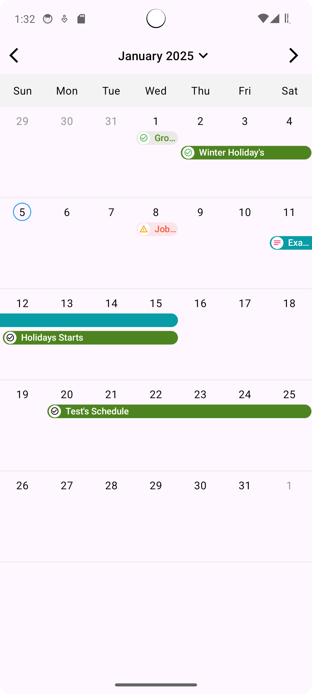

# Task-Calendar

Implement Task Calendar. Calendar draw task on dates just like google calendar

This project is a Task Calendar app that allows users to view and manage tasks over time. The app
displays a calendar view with tasks and events, enabling users to see their schedule and make note
of important dates.

# Features

Calendar View: Displays a dynamic calendar that allows users to scroll through months and select
dates.
Task Management: Users can add, view, and manage tasks with start and end dates.
Color-Coded Tasks: Tasks are color-coded based on their status or type, providing an
easy-to-understand visual cue.
Task Details: Each task displays a name, start date, end date, and an icon representing the type of
task.

### Core Module

The **core module** contains the business logic for the Task Calendar App.

# Screenshot

# Code Explanation

The MainActivity class contains the main logic for initializing and displaying the calendar.

# Layout

In the layout file (activity_main.xml), a custom CalendarLayout is used to display the calendar
view. The CalendarLayout is constrained within the parent layout and takes up the full width of the
screen with a dynamic height.

`
<com.task.sm.core.calendar.CalendarLayout

    android:id="@+id/calendarView"

    android:layout_width="match_parent"

    android:layout_height="wrap_content"

    app:layout_constraintStart_toStartOf="parent"

    app:layout_constraintTop_toTopOf="parent"
/>
`

# MainActivity Logic

The MainActivity initializes the calendar, sets a list of tasks, and handles various interactions
like scrolling through months, selecting dates, and handling height changes.

# Key Components:

Task List: A list of tasks is created and sorted by their start date. Each task includes:

startDate and endDate
taskName
taskColor (used to color code tasks)
taskImage (icon for the task)
iconColor (color of the icon)

# Year Dropdown:

The `getCalendarYear()` method generates a list of years based on the current year, ranging from 8
years ago to 10 years in the future.

# Contributing

Feel free to fork this repository and submit pull requests for any improvements or fixes.

# Instructions for Developers

If you'd like to contribute or use the core module in your own projects:

Clone the repository.
Navigate to the `core/ module` directory to find the core logic.
Use the Task class and related utilities to integrate calendar and task functionality into your application.